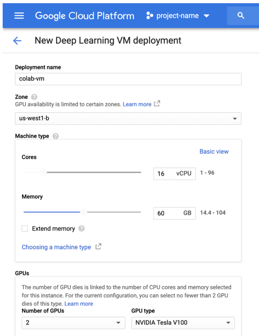
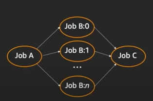
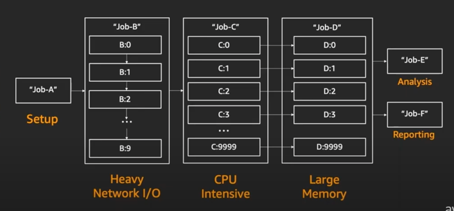
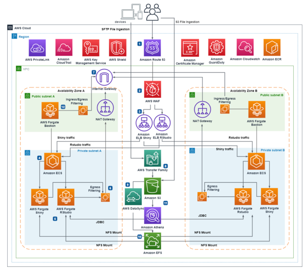

## Coding platform options:

### notebook (GCP): colab (for researchers and students; developed by Google; more computing power?)
  - steps:
      1. choose your VM on GCP:
         
          
         
      2. export the VM to localhost:port
      3. in colab, connect to the localport: [tutorial](https://medium.com/@yufengg/how-to-upgrade-colab-with-more-compute-64d53a9b05dc)
      4. when finished, need to stop manually kill VM
  - no consistent disk
  - can write a bash file to automate this
  - cost: only VM
  - need to reset env everytime (reinstalling packages etc)
  
### notebook (GCP & AWS): AI platform/sagemaker
  - steps:
      1. need to go to GCP/AWS console, open AI platform, and sagemaker service
      2. configure/start notebook instance (VM type, preinstalled packages)
      3. open notebook instance
      4. run multiple notebooks
      5. stop notebook instances
  - all notebooks run on one VM
  - can automate all steps in bash file

### notebook (AWS): sagemaker studio (if you want to open notebooks by link & configure VM types for each notebook)
  - steps:
      1. login in by url to open sagemaker studio
      2. each notebook can attach one VM, once you close the notebook or manually deattach the VM, VM stops running
          [cheap cost and all VM types](https://aws.amazon.com/sagemaker/pricing/)
          - Standard Instances:
           `ml.m5.16xlarge    64cpu +256GiB memory => $4.109/hr`
           `ml.m5.24xlarge    96cpu+384GiB memory => $6.163/hr`
          - Compute Optimized:
           `ml.c5.18xlarge    72cpu + 144 GiB memory => $4.147/hr`
           `ml.c5.24xlarge    96cpu + 192 GiB memory => $5.53/hr`
          - Accelerated Computing:
           `ml.g4dn.12xlarge 48cpu + 192 GiB memory + 4GPU => $5.453/hr`
           `ml.g4dn.16xlarge 64cpu + 256 GiB memory + 8GPU    => $6.066/hr`
  - persistant disk (home directory): [for example](https://aws.amazon.com/efs/pricing/): Europe (Ireland) region: `$0.046(GB-Mo)`
  - cost: VM (duration + VM type) + EFS (disk attached to sagemaker studio)
  - persistent env

### no IDE, only run files? multiple files on the same time?
  - AWS batch
  - configure your env: container
  - each file with specified/same VM type
  - can be scheduled
  - AWS Batch in numbers:
      - 1,234,000 vCPUs
      - 500,000 simulatenous jobs
      - 30GB docker image size
  - run parally or in sequence (up to you)
  - 
  - 
  
### prefer rstudio?
  - option1:
      - need to set up
      - steps:
          1. login a page
          2. choose your vm type, click start (start EC2 instance and run Rstudio container, export ip back)
          3. returned a url (for example: https://ip address:8080)
          4. open the url (rstudio url)
          5. click close the VM (shutdown EC2 instance)
  - option2:
      - need to setup
      - costy: at least one VM is running all the time in ECS cluster
      - 

